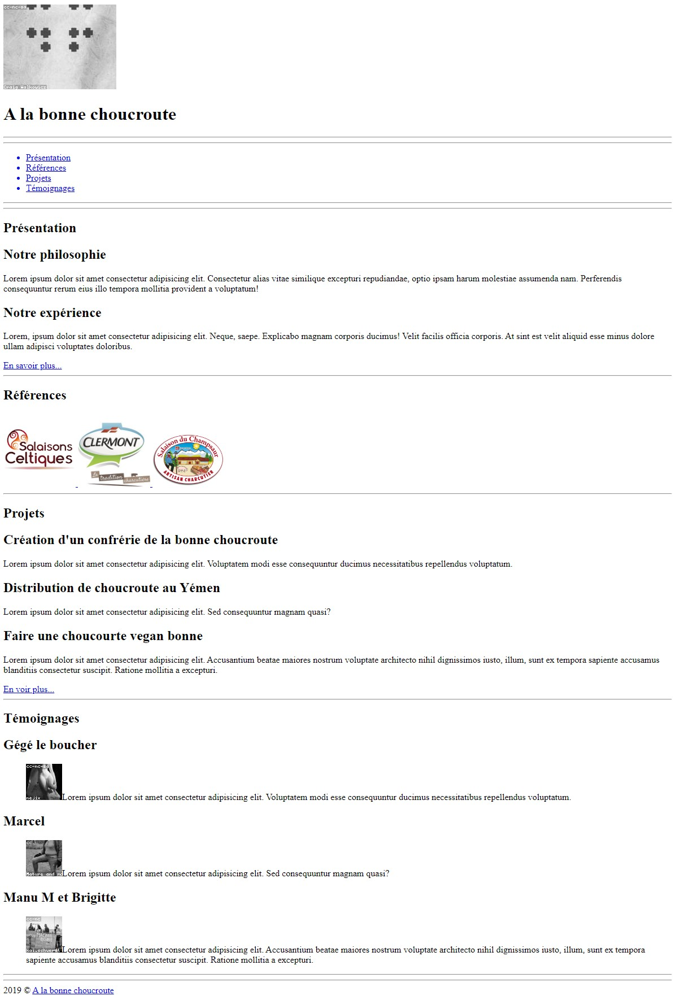

# Structure d’un site vitrine

- Un client veut un site web avec ces pages :
    - accueil
    - Projets
    - A propos
    - Contact
    
- Accueil :
  - une en-tête avec le logo et le nom de l’entreprise
  - une barre de navigation (non active pour le moment, sauf pour accueil)
  - une présentation rapide avec un lien vers la page a propos
  - les logos cliquables des principaux clients (le clic emmène au site du client)
  - Une partie descriptive des principaux projets avec un lien qui emmènera vers la page projets)
  - Une partie avec les témoignages (commentaires des clients)
  
- Le footer avec un copyright

- Les autres pages devront avoir la barre de navigation active et la structure de base avec des commentaires

***

**Exemple de rendu**

